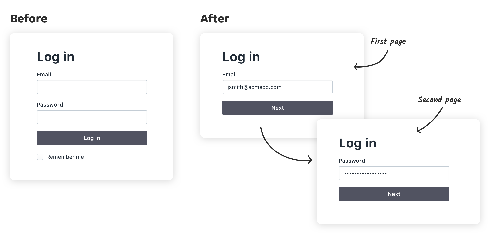

If you’d paid attention to login forms recently, you’ve probably noticed a growing number of apps have switched from a traditional email and password login page to a two page login that has the email and password fields on separate pages (sometimes called the “two step login”, “two page login”, or “that annoying login thing Google is doing”)

Why are more apps using this design pattern?

In this article, we’re going to explore the design decisions behind the two step login design pattern, why it’s used, when you should use it for your app, and some of the usability and (serious) privacy concerns it creates.

### First, a bit of history

To understand this pattern, we first have to look at the signup/registration process. The traditional email and password signup has been the standard for years but one of its major downsides is its abandonment rate. Google researchers found:

> “Most websites who offer a user registration mechanism find that at least 30% of users who start the process fail to finish”

[Source](https://sites.google.com/site/oauthgoog/UXFedLogin/summary)

But we also have conflicting reports. App analytics provider Heap.io looked at 79 SaaS products on their platform and found that conversion rate after a user clicks “Get Started” [was only 36.2%](https://heap.io/blog/data-stories/good-conversion-rate-signup-flow).  That’s a 63.8% abandonment rate. ***More than double Google’s estimate.*** 

Whether the abandonment rate is 30% or 60%, losing potential users is a major problem, so app designers looked for a solution.

### Introducing third party logins

The most popular solution that emerged was third party logins. Signing in with Google, Facebook, or Twitter took much of the work out of the signup process and allowed users to sign up in a couple of clicks.

Great solution right? Well, in theory. Turns out this solution brought its own set of problems.

Login pages went from this…

<%= partial(:picture, :locals => { :path => "/two-page-login/traditional-login", :alt_text => "Traditional login", :width => "416px", :style_class => "", :type => "png" }) %>

To this…

<%= partial(:picture, :locals => { :path => "/two-page-login/social-logins", :alt_text => "Social logins", :style_class => "", :width => "720px", :type => "png" }) %>

Not only does it look busy but usability testing showed it also introduced a slew of usability problems:

#### It confused some users

Users unfamiliar with the pattern would get confused by all the logos on the login page and would use the wrong email/password. For example, some users would see the Google icon and attempt to use their Google email and password combination in the email and password fields.

#### Users wouldn’t see the third party logins

Designers tried to reduce the visual clutter by making the third party logins less prominent so they wouldn’t visually compete with the email/password fields. But then users wouldn’t notice the third party logins and assumed there was only one way to create an account. Which means they’ve spent time and energy implementing functionality users don’t even realize is there.

But the worst and my personal pet peeve…

#### Users would forget what service they used to create their account

I’ll illustrate with a personal experience. Last week, I went to check out Product Hunt. I saw a cool product and wanted to upvote it. I hadn’t been on the site in a long time so I was presented with the login page.

<%= partial(:picture, :locals => { :path => "/two-page-login/ph-1", :alt_text => "Social logins", :caption => "", :width => "", :style_class => "bleed", :type => "png" }) %>

<%= partial(:picture, :locals => { :path => "/two-page-login/ph-2", :alt_text => "Social logins", :caption => "", :width => "", :style_class => "bleed", :type => "png" }) %>

<%= partial(:picture, :locals => { :path => "/two-page-login/ph-3", :alt_text => "Social logins", :caption => "", :width => "", :style_class => "bleed", :type => "png" }) %>

<%= partial(:picture, :locals => { :path => "/two-page-login/ph-4", :alt_text => "Social logins", :caption => "", :width => "", :style_class => "bleed", :type => "png" }) %>

It successfully logged me in but this looks like a new account. So I logged out and tried Twitter. Boom, there’s all my saved items and followers. What the hell happened?

One of the “features” of many of these third party logins is that if you attempt to log in and it doesn’t find an existing account, it will create a new account for you.

Great idea, horrible execution because now I have duplicate accounts on Product Hunt. If I was a less tech savvy user, I would have kept using the Google login and assumed that Product Hunt just lost my information for some inexplicable reason.

### Oh and don’t forget about Single Sign-on (SSO)

If that wasn’t complicated enough, now more organizations are requiring Single Sign-on for all apps used in their organization so they don’t have to manage credentials for dozens (or even hundreds) of their employees/students.

So designers would add that option to the already busy login page. And as you’ve probably guessed, yes, it caused more usability problems.

In addition to to the problems caused by having multiple options to choose from, some organizations wouldn’t even use the app login page and instead had a completely separate organization login page that employees were required to use.

For example, say a university student wants to check their university email. They know it’s using Gmail, so naturally they go to gmail.com. If they tried logging in with their university credentials, they would get an error that their account doesn’t exist.

Why? Because they first need to go to their university website and log in there to get redirected to their university email.

So there were clearly problems with these early attempts at a unified login page and there was a lot of room for improvement.

The Google research team summed up the situation by saying:

> “the early adopters in this space found that it was easy to design a user experience that was actually worse for users.”

Yeah, no kidding.

### Introducing the two page login form (aka the “federated login” pattern)

The Google research team developed a new pattern to address many of the usability problems with the previous solutions. Their idea: give users one place to log in and redirect them to to the correct service to finish logging in. They called this new pattern the [federated login](https://sites.google.com/site/oauthgoog/UXFedLogin/summary) and it’s the two page login you see on Google and other apps today.

It looks like a simple change but there’s some magic happening under the hood. Let’s take our example from Product Hunt and redesign it using a federated login. Remember the old login page looked like this…

<%= partial(:picture, :locals => { :path => "/two-page-login/ph-login", :alt_text => "Social logins", :caption => "", :width => "", :style_class => "", :type => "png" }) %>

Redesigning it with a federated login would look something like this:

<%= partial(:picture, :locals => { :path => "/two-page-login/ph-new-1", :alt_text => "Social logins", :caption => "", :width => "", :style_class => "", :type => "png" }) %>

Now if I enter my email and click next, here’s what happens: Product Hunt is going to check with the different authentication providers to see if any of them recognize my email…

<%= partial(:picture, :locals => { :path => "/two-page-login/social-check", :alt_text => "Social logins", :caption => "", :width => "", :style_class => "bleed", :type => "png" }) %>

So on the next page, I’m only presented with Twitter to finish my login.

<%= partial(:picture, :locals => { :path => "/two-page-login/ph-new-2", :alt_text => "Social logins", :caption => "", :width => "", :style_class => "", :type => "png" }) %>

If the user created an account with a third party service, only show them that service on the next step. If they didn’t use any service, ask for their password.

The pattern also allows for more options for added security. This pattern can easily include additional steps like two factor authentication, anti-phishing photo verification, or redirecting potential bot accounts to a captcha test.

### What about SSO?

Our student scenario would work much the same way. The student makes the incorrect assumption that they should go to gmail.com to check their email. But instead of an error, they would get redirected to their university login page.

This pattern embodies one of the principles of good UX: direct users where to go rather than giving them roadblocks.

### Negatives of the two page login pattern

Before you go implement it on all your apps, there’s some downsides to consider about the the two page login pattern and some strategies to address them.

#### You have to use an email

The one thing all these services have in common is that they use email. If you use usernames to log in (or want to give users that option) then you’ll probably run into problems checking if the user is using one of the third party logins.

#### It breaks many password managers

Roughly 12% of Americans use a password manager according to [a 2016 study by Pew Research](https://www.pewresearch.org/internet/2017/01/26/2-password-management-and-mobile-security/). And if you use one, you’ve probably noticed that the two page login often breaks the autofill functionality. I use one and I find that I’m often using the autofill twice: once to fill in my email, clicking next, and then using autofill again to fill in my password.

Google’s solution is to do add a hidden password field on the first page of the login form. When the field is filled, it will carry the password over to the next page. Unfortunately, it’s not a great solution because it doesn’t work with any of the password managers I’ve tested it with.

In my testing, I found that password managers work much like screen readers: if it’s not visible, it won’t fill in the field.

#### Serious privacy concerns

One of the biggest problems with this pattern is that you can look up if someone has an account simply by knowing their email address.

For example, let’s say there’s an online community that supports people trying to leave an abusive partner. If the app used a two page login pattern, someone could check if their partner is part of that community simply by knowing their email. That would have potentially catastrophic results.

It doesn’t just apply to the community itself. It also applies to the the apps that could be used to make a community like that. Slack, Discourse, Discord, and other community building apps have the responsibility to consider the consequences of their design decisions.

So while this design pattern solves a lot of usability problems, my warning would be to seriously consider if there’s potential for abuse before implementing this pattern in your next project. It’s our job as designers (and developers) to improve lives with technology, not harm them.

### Looking ahead

Just like the previous solutions, this pattern is an evolution. It’s an improvement over previous solutions but certainly not perfect. There’s a lot of interesting work being done in this space and I’m looking forward to seeing how we’ll be logging into our apps in the future.

Hopefully this has helped you understand the pattern better and will help you decide whether it’s a good fit for your future projects.